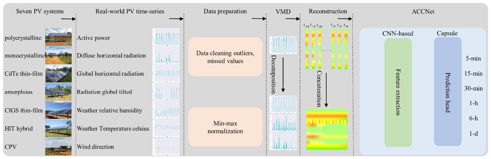

# ACCNet
## An innovative short-term multihorizon photovoltaic power output forecasting method based on variational mode decomposition and a capsule convolutional neural network

Abstract
----------
Due to its importance regarding the integration, economic dispatch, and operation of PV smart grid systems, infrastructure planning, and budgeting, the accurate forecasting of photovoltaic (PV) power generation has drawn increasing research and industry attention. However, the instability, intermittence, and randomness of solar irradiance impose difficulties on the short-term economic dispatch of a smart integrated power, grid and significantly increase the risks arising from PV generation in a power system, exposing PV generators to potential additional costs. A deep convolutional neural network (CNN)-based method can effectively improve the performance of PV generation point prediction and probabilistic interval prediction by efficiently extracting nonlinear features at each frequency. Nevertheless, existing deep learning (DL) studies have mostly focused on more complex network topologies and data decomposition algorithms, ignoring the importance of simultaneously forecasting the PV power produced over multiple temporal periods. To solve the described challenge, we propose a novel two-stage DL approach for PV generation prediction. A temporal signal decomposition technique called variational mode decomposition (VMD) is employed in the first stage to construct association mappings from fine-grained features to images. In the second stage, an innovative capsule CNN (ACCNet) is proposed to obtain very short-term multihorizon ahead output power predictions for seven different PV systems based on polycrystalline, monocrystalline, cadmium telluride (CdTe) thin-film, amorphous, copper indium gallium diselenide (CIGS) thin-film, heterojunction with intrinsic thin layer (HIT) hybrid, and concentrated photovoltaic (CPV) technologies. The input parameters for each system include solar radiation (diffuse/global horizontal radiation (DHR/GHR) and radiation diffuse/global tilted (RDT/RGT)) and ambient temperature, while the output parameter is the power output of each PV system. The proposed model is validated with the historical datasets of a PV system downloaded from the Desert Knowledge Precinct in Central Australia (DKASC) homepage. The performance of the developed method is proven in detail based on seven different PV systems over multiple data periods, and the experimental results reveal that the proposed approach displays significant improvements and robustness in point forecasting and probabilistic forecasting tasks. We will release the source code to ensure reproducibility and facilitate future work. Our code is available at [Pytorch-(Mpf)](https://github.com/YunDuanFei/ACCNet).

--------------------------------------------------
Overall framework of PV power forecasting based on ACCNet.

## Contact Information

If you have any suggestion or question, you can contact us by: liuyunfei_215@163.com. Thanks for your attention!